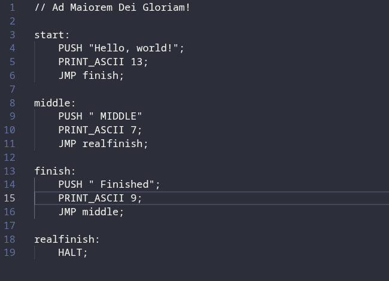

# RenanLang

A stack-based assembly-like language, made by a teen for *Hack Club* with love.


## Architecture
**Relang** is a bytecode compiled language, what means that the raw text file is compiled to 2-bytes long binary instructions which are then interpreted by a *virtual machine*. It is stack based, which means all data is pushed and pop through the stack and the operations are done only on that.
Jumps and conditionals are supported, which means that the language is **Turing complete** in math concepts.
All the docs are on OPCODES.md

## Features
- Compiler and Lexer
- Jump labels
- String literal code expansion
- Comments
- Virtual machine

## Objective
The objective of this language is purelly educational. There's no reason to use it in any other case.

## Build locally
1. Clone the repository with:
```bash
git clone https://github.com/Renan-G-projec/RenanLang.git
```

2. Build locally
```bash
make
```

3. Run some examples
```bash
build/RenanLang examples/jmp.relang;
```

## I can't run / Don't want to compile the binary
You can see a demo video on https://stardance.hackclub.com/projects/40179

## AI usage declaration
I only used AI to the initial idea, decisions like use try-catch or if statements and label mapping. Zero lines of code were written by it.

## OBSERVATIONS
The integers allowed by push are only 1 byte. Exceding 127 will cause an underflow to happen.
Char literals become integers at compile time.
String literals (Always surrounded by "this") expand to a long sequence of pushing char literals (In reverse to print after!) 
